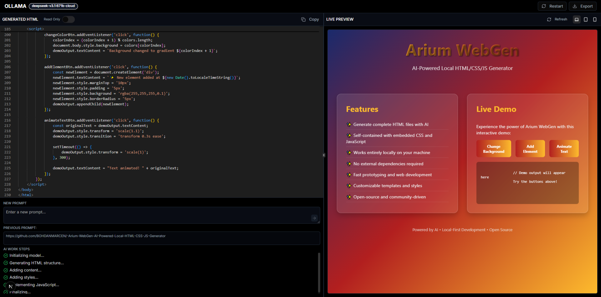
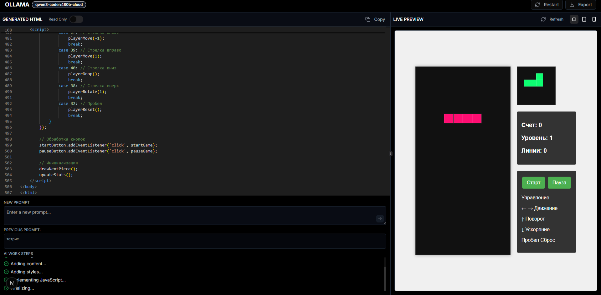

# 🌐 Arium WebGen — AI-Powered Local HTML/CSS/JS Generator

<div align="center">

**Lightweight. Fast. Local-first. Perfect companion to Arium IDE.**

[](https://nextjs.org/)
[](https://react.dev/)
[](https://www.typescriptlang.org/)
[](LICENSE)

[Demo](#) • [Documentation](#-documentation) • [Issues](https://github.com/BOHDANMARCEN/-Arium-WebGen-AI-Powered-Local-HTML-CSS-JS-Generator/issues) • [Discussions](https://github.com/BOHDANMARCEN/-Arium-WebGen-AI-Powered-Local-HTML-CSS-JS-Generator/discussions)

</div>

---

## 📖 About the Project

**Arium WebGen** is a modern local AI-powered web page generator that creates complete HTML, CSS, and JavaScript pages based on simple text descriptions. The project works entirely locally (Ollama / LM Studio) or through any OpenAI-compatible API.

This is a minimal, fast tool for developers, designers, and AI enthusiasts — and a key component of the **Arium** ecosystem.

### 📸 Screenshots

<div align="center">


*Welcome screen with provider selection*


*Real-time code generation with live preview*


*Generated web page with code editor*

</div>

### ✨ Key Features

- 🤖 **AI Web Page Generation** — Create complete web pages from natural descriptions
- 👁️ **Live Preview** — View results in real-time on different devices (Desktop, Mobile, Tablet)
- ✏️ **Built-in Code Editor** — Monaco Editor for on-the-fly code editing
- 🔌 **Multiple AI Provider Support** — Ollama, LM Studio, DeepSeek, OpenAI-compatible APIs
- 🧠 **Thinking Models** — Support for reasoning models (Qwen, DeepCoder, etc.)
- 🎨 **Modern UI** — Dark interface built on Next.js 15, React 19, Tailwind CSS, and shadcn/ui
- 🐳 **Docker Support** — Easy deployment via Docker container

---

## 🚀 Quick Start

### Requirements

- Node.js 20+ or Docker
- npm, yarn, or pnpm
- (Optional) Ollama or LM Studio for local models

### Installation

1. **Clone the repository:**

```bash
git clone https://github.com/BOHDANMARCEN/-Arium-WebGen-AI-Powered-Local-HTML-CSS-JS-Generator.git
cd -Arium-WebGen-AI-Powered-Local-HTML-CSS-JS-Generator
```

2. **Install dependencies:**

```bash
npm install
# or
yarn install
# or
pnpm install
```

3. **Configure environment variables:**

Create a `.env.local` file in the project root:

```env
# DeepSeek Configuration
DEEPSEEK_API_KEY=your_deepseek_api_key
DEEPSEEK_API_BASE=https://api.deepseek.com/v1

# Local Providers (Ollama)
OLLAMA_API_BASE=http://localhost:11434

# Local Providers (LM Studio)
LM_STUDIO_API_BASE=http://localhost:1234/v1

# Custom OpenAI-compatible API
# OPENAI_COMPATIBLE_API_KEY=your_key_here
# OPENAI_COMPATIBLE_API_BASE=https://api.provider.com/v1

# Default Provider (ollama, lm_studio, deepseek, openai_compatible)
DEFAULT_PROVIDER=lm_studio
```

4. **Run the project:**

```bash
npm run dev
# or
yarn dev
# or
pnpm dev
```

5. **Open your browser:**

Navigate to [http://localhost:3000](http://localhost:3000)

---

## 🐳 Docker

### Running with Docker

```bash
docker build -t arium-webgen .
docker run -p 3000:3000 \
  -e DEFAULT_PROVIDER=lm_studio \
  -e OLLAMA_API_BASE=http://host.docker.internal:11434 \
  -e LM_STUDIO_API_BASE=http://host.docker.internal:1234/v1 \
  arium-webgen
```

### Docker Compose

```yaml
version: '3.8'
services:
  webgen:
    build: .
    ports:
      - "3000:3000"
    environment:
      - DEFAULT_PROVIDER=lm_studio
      - OLLAMA_API_BASE=http://host.docker.internal:11434
      - LM_STUDIO_API_BASE=http://host.docker.internal:1234/v1
```

---

## 🧠 Supported Providers

### 🔸 Local Models

#### Ollama
- **Description:** Local AI models via Ollama
- **Setup:** Install [Ollama](https://ollama.ai/) and start the server
- **API Base:** `http://localhost:11434`
- **API Key:** Not required

#### LM Studio
- **Description:** Local AI models via LM Studio
- **Setup:** Install [LM Studio](https://lmstudio.ai/) and start the local server
- **API Base:** `http://localhost:1234/v1`
- **API Key:** Not required

### 🔸 Cloud Providers

#### DeepSeek
- **Description:** AI models from DeepSeek
- **Setup:** Get an API key from [DeepSeek](https://www.deepseek.com/)
- **API Base:** `https://api.deepseek.com/v1`
- **API Key:** Required

#### Custom OpenAI-compatible API
- **Description:** Any OpenAI-compatible API
- **Supported Services:** OpenAI, Together AI, Anyscale, Groq, Claude AI, Anthropic, and more
- **Setup:** Specify the base URL and API key in `.env.local`

---

## 🛠 How to Use

### Basic Usage

1. **Enter a web page description**
   - Example: "Create a landing page for a mobile app in purple tones with animations"

2. **Select AI provider and model**
   - Choose a provider (Ollama, LM Studio, DeepSeek, etc.)
   - Select a model from available options

3. **Configure parameters (optional)**
   - System prompt (default, thinking, custom)
   - Maximum token count

4. **Click GENERATE**
   - AI will start generating code in real-time
   - For thinking models, you'll see the reasoning process

5. **View and edit**
   - View results in Live Preview
   - Edit code in the built-in editor
   - Switch between Desktop, Mobile, and Tablet modes

6. **Export the result**
   - Copy code or save locally

### Advanced Features

- **Thinking Models:** Use reasoning models for better understanding of the generation process
- **Custom System Prompts:** Create custom system prompts for specific tasks
- **Token Limits:** Configure maximum token count to control response length

---

## 📁 Project Structure

```
Arium-WebGen/
├── app/                    # Next.js App Router
│   ├── api/               # API routes
│   │   ├── generate-code/ # Code generation
│   │   ├── get-models/    # Get models
│   │   └── get-default-provider/
│   ├── layout.tsx         # Root layout
│   └── page.tsx           # Main page
├── components/            # React components
│   ├── ui/               # shadcn/ui components
│   ├── code-editor.tsx   # Monaco Editor
│   ├── generation-view.tsx
│   ├── welcome-view.tsx
│   └── ...
├── lib/                  # Utilities and configuration
│   ├── providers/        # Provider configuration
│   └── utils.ts
├── public/               # Static files
├── Dockerfile           # Docker configuration
├── package.json
└── README.md
```

---

## 🗺 Roadmap

### 🧩 Models and Providers

- [x] Ollama support
- [x] LM Studio support
- [x] DeepSeek
- [x] OpenAI-compatible API
- [x] Thinking Models Support (Qwen, DeepCoder, etc.)
- [ ] Anthropic Claude
- [ ] Groq
- [ ] Together AI
- [ ] Perplexity

### 🧱 Code Generation

- [ ] Multi-file structure (index.html, style.css, app.js)
- [ ] ZIP project export
- [ ] Agentic diff-editing
- [ ] Projects: save / history
- [ ] Versioning of generated code

### 🎨 Interface

- [ ] Light theme
- [ ] Custom editor settings
- [ ] Drag-and-drop UI components
- [ ] Templates and examples
- [ ] Generation history

### 💻 Desktop Version

- [ ] Electron app
- [ ] Native notifications
- [ ] Offline mode

### 🔧 Developer Tools

- [ ] CLI version
- [ ] VS Code extension
- [ ] API for integrations

---

## 🤝 Contributing

We welcome contributions! Please read [CONTRIBUTING.md](CONTRIBUTING.md) for details on our code of conduct and the process for submitting pull requests.

### How to Contribute

1. Fork the project
2. Create a feature branch (`git checkout -b feature/AmazingFeature`)
3. Commit your changes (`git commit -m 'Add some AmazingFeature'`)
4. Push to the branch (`git push origin feature/AmazingFeature`)
5. Open a Pull Request

---

## 📚 Documentation

- [Architecture 3.0](docs/ARCHITECTURE.md) - Comprehensive architecture document with diagrams and implementation plan
- [Architecture 3.0 Starter Code](docs/ARCHITECTURE_3_STARTER.md) - Full project description with ready-to-use starter code
- [Provider Setup](docs/PROVIDERS.md)
- [API Documentation](docs/API.md)
- [Development](docs/DEVELOPMENT.md)

---

## 🐛 Issues and Support

If you found a bug or have a suggestion, please:
- Check [existing issues](https://github.com/BOHDANMARCEN/-Arium-WebGen-AI-Powered-Local-HTML-CSS-JS-Generator/issues)
- Create a [new issue](https://github.com/BOHDANMARCEN/-Arium-WebGen-AI-Powered-Local-HTML-CSS-JS-Generator/issues/new) with a detailed description

---

## 📄 License

This project is licensed under the MIT License - see the [LICENSE](LICENSE) file for details.

---

## 🙏 Acknowledgments

- [Next.js](https://nextjs.org/) for the amazing framework
- [shadcn/ui](https://ui.shadcn.com/) for UI components
- [Monaco Editor](https://microsoft.github.io/monaco-editor/) for the code editor
- All contributors and users of the project

---

<div align="center">

**Made with ❤️ for the developer community**

[⭐ Star the project](https://github.com/BOHDANMARCEN/-Arium-WebGen-AI-Powered-Local-HTML-CSS-JS-Generator) • [🐛 Report a bug](https://github.com/BOHDANMARCEN/-Arium-WebGen-AI-Powered-Local-HTML-CSS-JS-Generator/issues) • [💬 Discussions](https://github.com/BOHDANMARCEN/-Arium-WebGen-AI-Powered-Local-HTML-CSS-JS-Generator/discussions)

</div>
