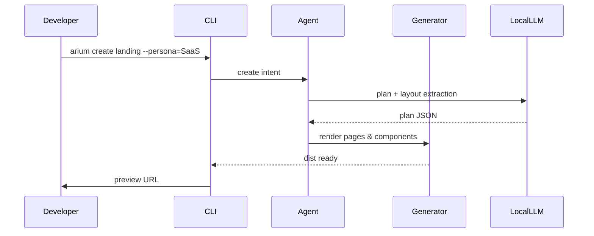

# Arium WebGen — Architecture 3.0 (Diagrams, Functional Modules, AI Agent)

> Comprehensive architectural document for Arium WebGen 3.0 — ready for implementation. Contains diagrams, modules, data flow, AI agent description, interfaces, and backlog for the first iteration.

---

## 1. Overview

Arium WebGen 3.0 — local, private, AI-first Website Builder. Core principles: modularity, offline-capable AI, reproducible project structure, component-driven rendering, live preview, deploy-ready exports.

---

## 2. High-level diagram (Mermaid)

```mermaid
flowchart TB
  subgraph LocalDev
    CLI[CLI / TUI]
    IDE[Optional Desktop IDE (Electron + React)]
    FS[(project/ repository)]
    PreviewServer[Preview Server (Vite/Express)]
    LocalLLM[Local LLMs (llama.cpp, ggml)]
    ImageTool[Image Optimizer (sharp)]
  end

  subgraph Core
    ProjectCore(Project Manager)
    Generator(HTML/CSS/JS Generator)
    ComponentMgr(Component Manager)
    ThemeSvc(Theme Engine)
    AIModule(AI Tools Pipeline)
    WidgetLib(Widgets: carousel, forms, modal)
    Exporter(Export & Deploy)
  end

  subgraph OptionalCloud
    RemoteGitHub[GitHub / Git Remote]
    CI[CI / GitHub Actions]
    Vercel[Vercel / Netlify]
  end

  CLI --> ProjectCore
  IDE --> ProjectCore
  ProjectCore --> FS
  ProjectCore --> ComponentMgr
  ProjectCore --> ThemeSvc
  ComponentMgr --> Generator
  ThemeSvc --> Generator
  LocalLLM --> AIModule
  AIModule --> Generator
  ImageTool --> Exporter
  Generator --> PreviewServer
  PreviewServer --> Browser[Developer Browser]
  Exporter --> RemoteGitHub
  RemoteGitHub --> CI
  CI --> Vercel
```

---

## 3. Core subsystems & responsibilities

### 3.1 Project Manager (projectCore)

* `project.json` lifecycle management (init, add-page, add-language, set-theme)
* Project graph (pages, components, assets, content)
* Dependency map (which pages include which components)
* Version snapshots & history (.arium/history)

### 3.2 Component Manager

* CRUD for components (html + metadata)
* Slot/prop system and transclusion
* Global propagation: when component updates → patch pages that include it
* Component registry and semantic tags (hero, footer, testimonial)

### 3.3 Theme Engine

* `theme.json` canonical structure
* CSS generation pipeline: raw CSS / Tailwind config / Bootstrap toggle
* Runtime variable injection (CSS variables, CSS custom properties)
* Theme transforms (light/dark, high-contrast)

### 3.4 Generator

* Templating engine (Handlebars/EJS/Custom) to render pages and components to `dist/`
* Content rendering (JSON-driven CMS pages)
* Widget injector (adds required JS bundles per widget usage)
* Minify & asset fingerprinting

### 3.5 AI Tools Pipeline (AIModule)

* Local & remote LLM adapter
* Tools: html_generate, css_generate, update_component, fix_layout, seo_optimizer, content_generator, style_extractor
* Pipeline runner & dry-run/apply modes with changelogs

### 3.6 Preview Server

* Dev server with WebSocket live-reload
* Hot-reload on component, theme, content changes
* Inline editing endpoints (PATCH page/component)

### 3.7 Exporter & Deploy

* ZIP export, static artifact
* GitHub Pages deploy (token), Vercel integration (auto-generate workflow)
* Export manifest (project.json + dist)

---

## 4. Functional modules (detailed)

Each module listed with API surface, inputs, outputs, and example commands.

### 4.1 CLI module

* Commands: init, add-page, make-component, build, preview, export, deploy, fix_site, generate-content, translate-site
* Plugin hooks: pre-build, post-build
* Config flags: --theme, --ui-framework, --lang, --dry-run

### 4.2 File System Layer

* Path normalization, safe writes, atomic writes (tmp -> move)
* Snapshot API: snapshot.create(), snapshot.restore(id)

### 4.3 Template Renderer

* renderPage(pageSpec, context) -> html
* renderComponent(componentSpec, props) -> html
* registerHelper(name, fn) for templates

### 4.4 Component Registry API

* registerComponent(name, meta)
* listComponents()
* findUsage(componentName) -> [pages]

### 4.5 Theme API

* loadTheme(path)
* applyThemeToCSS(theme, cssTemplate)
* switchTheme(name)

### 4.6 AI Adapter

* sendPrompt(prompt, params) -> {choices, usage}
* localModel.invoke(input) -> result
* toolRunner.run(toolName, args)

### 4.7 Fixer / QA Engine

* runChecks(project) -> report
* applyFixes(report, policy) -> changes

### 4.8 Widgets Library

* widget.register('carousel', {init, bundle})
* widget.inject(page, config)

### 4.9 Content Engine (file-based CMS)

* CRUD for content items
* buildContentIndex() -> for search & tags

---

## 5. AI Agent: "WebGen Agent" — design & workflows

### 5.1 Purpose

WebGen Agent is an assistant that can: generate pages, fix layout issues, optimize SEO, create content, extract styles, and perform batch project operations via structured commands.

### 5.2 Components

* **Controller**: orchestrates tasks and user prompts
* **Planner**: converts user intent into ordered tasks (semantic layout engine)
* **Executor**: runs tasks using generator, component manager, theme engine
* **Verifier**: runs QA checks and returns diagnostics
* **Knowledge Base**: local cache of templates, style rules, heuristics

### 5.3 Communication

* Primary interface: CLI + Local HTTP JSON API (for IDE/UI)
* Agent accepts high-level intents (JSON):

  ```json
  { "intent": "create_landing", "params": { "tone": "professional", "lang": "en", "persona": "SaaS" } }
  ```
* Agent returns plan + patch set + dry-run preview

### 5.4 Planner example

Input: "create SaaS landing with pricing"
Planner output:

1. create pages: index.html, pricing.html
2. create components: header, hero, features, pricing-grid, footer
3. populate content skeleton
4. generate theme (modern)
5. run preview

### 5.5 Executor (example steps)

* generator.renderPage for each page
* register widgets used
* optimizer.compressImages
* seo_optimizer.apply
* generator.buildDist

### 5.6 Safety & Modes

* Modes: `suggest` (instructions + diff), `apply` (make changes), `audit` (only report)
* Always produce an explicit changelog and snapshot before apply

---

## 6. Data flows & sequence (Mermaid)



---

## 7. Implementation backlog (first 8 sprints, 2-week sprints)

* **Sprint 1**: Project skeleton, CLI, project.json, build -> dist
* **Sprint 2**: Component manager CRUD + propagation, template renderer
* **Sprint 3**: Theme engine + theme.json, CSS pipeline
* **Sprint 4**: Preview server + livereload, hot-edit endpoints
* **Sprint 5**: AI Adapter skeleton + html_generate (LLM prompts), dry-run
* **Sprint 6**: fix_layout + seo_optimizer + compress_images
* **Sprint 7**: content engine (file CMS) + multilingual scaffolding
* **Sprint 8**: Agent planner + executor + QA gates

---

## 8. Example: Agent prompt templates (internal)

* **Create landing**: `"Create a responsive SaaS landing with hero, 3 features, pricing, testimonials, and contact form. Tone: professional, CTA-focused. Theme: modern, blue."`
* **Fix layout**: `"Analyze pages/index.html for mobile issues and propose fixes. Return patch set and confidence."`

---

## 9. Dev notes & implementation hints

* Prefer Node.js for speed of tooling and ecosystem (sharp, postcss, vite)
* Keep core logic language-agnostic to later port to Rust/Go for CLI speed
* Use atomic file writes and snapshots to keep user projects safe
* Store heavy LLM models optionally via `models/` and use adapter pattern

---

## 10. Deliverables & artifacts (what can be generated next)

* Full mermaid diagrams exported as SVG
* `project.json` + example landing template (dist-ready)
* `CLI` skeleton (bin/arium) + example commands
* `agent` pseudo-code + sample planner implementation

---

## 11. Next immediate steps (recommended)

1. Implement Sprint 1 & 2 to get working prototype.
2. Add local LLM adapter and a simple `html_generate` for iteration.
3. Build QA gates and preview server.

---

## 12. Contacts / meta

* Document created for Богдан — engineering-first, gentle, ready to implement.

---

## 13. Project Structure (3.0)

```
arium-webgen-3.0/
├── bin/
│   └── arium                    # CLI entry point
├── src/
│   ├── core/
│   │   ├── project-manager.ts   # Project lifecycle
│   │   ├── component-manager.ts # Component CRUD & registry
│   │   ├── theme-engine.ts      # Theme system
│   │   └── generator.ts         # Template renderer
│   ├── ai/
│   │   ├── adapter.ts           # LLM adapter (local/remote)
│   │   ├── agent/
│   │   │   ├── controller.ts    # Agent orchestrator
│   │   │   ├── planner.ts        # Intent → tasks
│   │   │   ├── executor.ts       # Task runner
│   │   │   └── verifier.ts       # QA checks
│   │   └── tools/
│   │       ├── html-generate.ts
│   │       ├── fix-layout.ts
│   │       ├── seo-optimizer.ts
│   │       └── content-generator.ts
│   ├── server/
│   │   ├── preview-server.ts    # Dev server
│   │   └── websocket.ts         # Live reload
│   ├── export/
│   │   ├── zip-exporter.ts
│   │   └── deploy/
│   │       ├── github-pages.ts
│   │       └── vercel.ts
│   └── widgets/
│       ├── carousel.ts
│       ├── forms.ts
│       └── modal.ts
├── templates/                   # Default templates
├── models/                      # Optional LLM models
├── .arium/                      # Project metadata
│   ├── history/                 # Snapshots
│   └── cache/
└── dist/                        # Build output
```

---

## 14. API Examples

### CLI Commands

```bash
# Initialize project
arium init my-project --theme=modern

# Create page
arium add-page about --template=landing

# Create component
arium make-component hero --type=section

# Build project
arium build --minify

# Start preview server
arium preview --port=3000

# AI: Generate landing page
arium generate landing --persona=SaaS --tone=professional

# AI: Fix layout issues
arium fix layout --page=index --mobile

# Export project
arium export --format=zip

# Deploy to Vercel
arium deploy --provider=vercel --token=xxx
```

### JSON API (for IDE integration)

```typescript
// POST /api/agent/intent
{
  "intent": "create_landing",
  "params": {
    "tone": "professional",
    "lang": "en",
    "persona": "SaaS",
    "sections": ["hero", "features", "pricing", "testimonials"]
  }
}

// Response
{
  "plan": [...],
  "changes": [...],
  "preview": "http://localhost:3000/preview/abc123"
}
```

---

## 15. Technology Stack

### Core
- **Runtime**: Node.js 20+
- **Language**: TypeScript 5+
- **CLI Framework**: Commander.js or Yargs
- **Template Engine**: Handlebars or EJS
- **Build Tool**: Vite or esbuild

### AI/ML
- **Local LLM**: llama.cpp, ggml, or Ollama
- **Remote LLM**: OpenAI, Anthropic, DeepSeek (via adapter)
- **Vector DB**: Optional (for knowledge base)

### UI/Preview
- **Preview Server**: Vite Dev Server or Express
- **WebSocket**: ws or socket.io
- **Desktop IDE**: Electron + React (optional)

### Export/Deploy
- **Image Processing**: sharp
- **CSS Processing**: PostCSS
- **Minification**: terser, cssnano
- **Deploy**: GitHub API, Vercel API

---

## 16. Security & Privacy

* All AI processing is local by default
* No data sent to external services unless explicitly configured
* Project files remain on user's machine
* Optional cloud sync (encrypted)
* API keys stored securely (OS keychain)

---

## 17. Performance Targets

* CLI commands: < 500ms for most operations
* Build time: < 5s for typical project (10-20 pages)
* Preview server startup: < 1s
* AI generation: depends on model (local: 5-30s, remote: 2-10s)
* Hot reload: < 100ms

---

## 18. Testing Strategy

* Unit tests for core modules (Jest/Vitest)
* Integration tests for CLI commands
* E2E tests for preview server
* AI tool tests with mock LLM responses
* Snapshot tests for generated HTML/CSS

---

## 19. Migration Path (from 2.0 to 3.0)

* Export current projects to static HTML
* Import into 3.0 project structure
* Convert to component-based architecture
* Migrate themes to theme.json format

---

## 20. Future Considerations

* Rust/Go rewrite for CLI performance
* Plugin system for custom widgets
* Marketplace for components/themes
* Collaborative editing (WebRTC)
* Multi-language support (i18n)
* Advanced AI features (style transfer, layout suggestions)

---

*Last updated: 2025-01-11*
*Version: 3.0.0-alpha*

